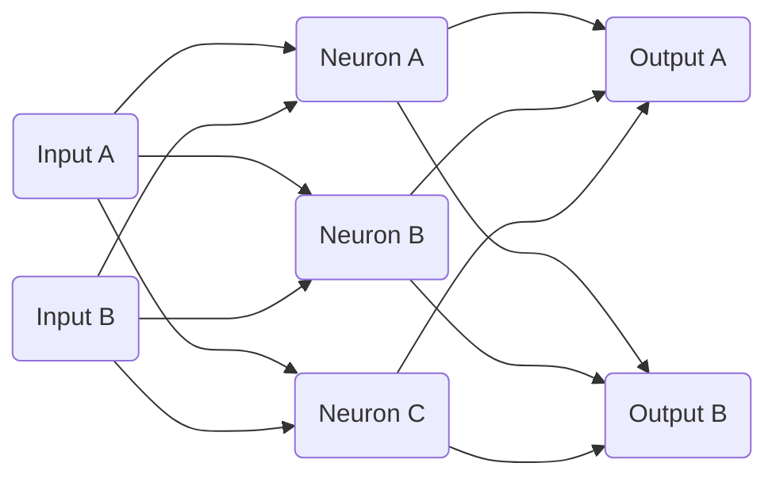

# Lossless, a Go-Based ML Library
## Introduction and Overview
Hi, my name is Egan Bosch, and I am currently a fourth-year computational mathematics major at UCLA. I have fallen in love with machine learning as of late, and also have a bit of an obsession with doing things myself from scratch. So, as a way to teach myself Go, as well as put some of the things I'd been learning into practice, I created my first Go ML library. Now, it worked, but it was slow, as I had created a kind of complicated "expression" data structure to automatically calculate gradients for me. However, this presented two problems:
1. No matter what I did to try and increase the performance of my data structure it simply did not scale well to very large or very deep networks.
2. My network could only train on one input at a time as a consequence to how things were set up.

Not ideal. So, a few months later, feeling inspired and after a sufficiently long pondering session I essentially rederived how to do backpropagation for basic MLP's (which is not insane, I'm aware) but the simplicity of doing just a few matrix multiplications got me excited enough to create Lossless, which has now evolved somewhat. It is still young (as of the time I am writing this, I created it about a week ago), so expect updates in the future, and let me know if you wish to collaborate!
## Getting Started
1. Download the latest version of Go [here](https://go.dev/dl/).
2. Create your project directory, and run `go mod init [your project name]`
3. Run `go get github.com/EganBoschCodes/lossless`
4. Get to creating!
## Creating your First Network
The way I handled building networks to a certain degree mimics PyTorch's technique. I say to a certain degree, as I have never used PyTorch. However, let's make a nice basic baby MLP.

So we have a vector with two entries as input, a hidden layer with three neurons, and then the output layer giving back another two values, representing a one-hot vector for classifying between two separate classes. How would we make this with code?

### The Network Initialization
First, we have to build the network. This is a Multi-Layer Perceptron, so we will use the networks.Perceptron class.
```Go
import "lossless/neuralnetworks/networks"

func  main() {
	mlp := networks.Perceptron{}
}
```
Now we have to specify the shape of the network. To do this, we will call the Initialize method of our MLP. The first argument is the size of the input vector, and then we pass it all the layers we will be using. Let's use hyperbolic tangent as our activation function after our first layer, and softmax for the outputs, as is standard for classification.
```Go
import (
	"lossless/neuralnetworks/networks"
	"lossless/neuralnetworks/layers"
)

func  main() {
	mlp := networks.Perceptron{}
	mlp.Initialize(2,
		&layers.LinearLayer{Outputs: 3},
		&layers.TanhLayer{},
		&layers.LinearLayer{Outputs: 2},
		&layers.SoftmaxLayer{},
	)
}
```
Just like that, we have our perceptron set up. There are still some parameters that you can tweak, such as batch size and learning rate.
```Go
func  main() {
	mlp := networks.Perceptron{}
	...
	mlp.BatchSize = 32
	mlp.LearningRate = 0.05
}
```
Now all we need is a dataset!
### Datasets in Lossless
In lossless, networks train on arrays of `datasets.DataPoint`. This is a super simple struct, containing two `[]float64` properties: one called Input, the other Output. We can make our own datapoint very simply.
```Go
func  main() {
	...
	pointA := datasets.DataPoint{
		Input: []float64{0, 1},
		Output: []float64{1, 0},
	}
}
```
Go about doing this however you want to, create a toy dataset if you'd like, but create a number of DataPoints and stick them all in an array.
```Go
func  main() {
	...
	var myDataset []datasets.DataPoint
	myDataset = MyDatasetGenerationFunction()
}
```
Let's assume you made 100 DataPoints, and you want to train your network on 80 of them and test on the remaining 20.
```Go
func  main() {
	...
	trainingData, testData := myDataset[:80], myDataset[80:]
}
```
Now we have everything we need to actually train our network!
### Training the MLP
Now, this is the easiest part! Simply call the Train method of the MLP, specifying your training data, test data, and how long you want it to train for.
```Go
func  main() {
	...
	mlp.Train(trainingData, testData, 10*time.Second)
}
```
And exactly as expected, your network will train for 10 seconds! It will let you know how good the random baseline was in terms of loss and correct categorization on your test data, give you a progress bar for training, then tell you how the network performs on the test data at the end. It will look a little something like:
```bash
Beginning Loss: 6.681
Correct Guesses: 8/20 (40.00%)

Training Progress : -{▒▒▒▒▒▒▒▒▒▒▒▒▒▒▒▒▒▒▒▒}- (100.0%)  

Final Loss: 0.000
Correct Guesses: 20/20 (100.00%)

Trained Epochs: 24347, Trained Datapoints: 1947832
```

So now your network is trained! But of course, now that it's trained, you want to be able to save it and run it in your other Go programs without the hassle of retraining!
### Saving your Networks
Luckily, we have you covered. When you want to save your networks, all it takes is a call to the Save method on your MLP. The method takes two arguments: the folder you wish to save your file in, and the name of your network.
```Go
func  main() {
	...
	mlp.Save("savednetworks", "MyMLP")
}
```
Now, in your project directory, in the `savednetworks` folder, you will find a file titled `MyMLP.lsls`. This file is not human readable, as we wanted to be as file-size economical as possible for large networks, but now it is saved! And it get it back, it is rather simple as well.
```Go
func  main() {
	mlp := networks.Perceptron{}
	mlp.Open("savednetworks", "MyMLP")
}
```
Now `mlp` contains all the data from your saved network!
### Exporting your Networks to Other Languages
Sometimes you want to write in a language other than Go, but you just used the beautiful ML library Lossless to train and save a neural network for you. Perhaps you want to be able to actually see numerically what weights your trained network
uses. Well, in that case, you can use the PrettyPrint method.
```Go
func  main() {
	...
	mlp.PrettyPrint("savednetworks","MyMLP")
}
```
Now if you check `savednetworks`, there will be a file `MyMLP.txt` containing in human readable form a summary of your network as well as all the info necessary to export it into another language.
## More In-Depth Documentation
I do my best to document the code, but my hope is that in the near future I will be able to make a folder of `.md` files documenting all the different features. Thank you for checking out Lossless!